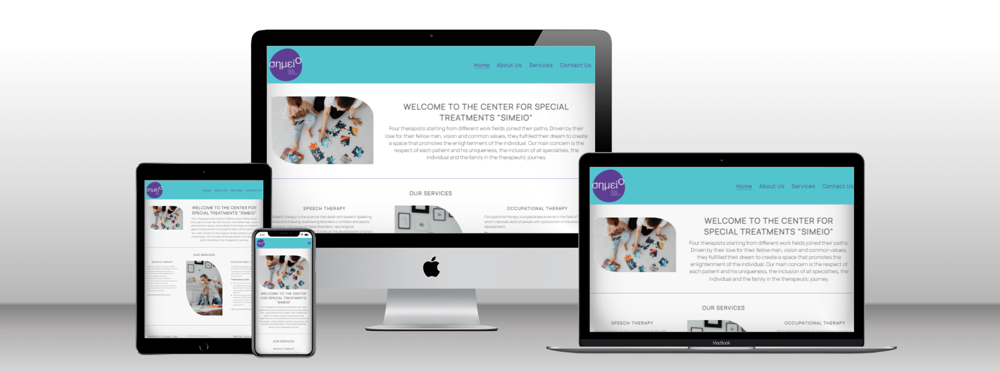

# Simeio Therapy
This project has been developed for the Special Treatments Center "simeio" based in Thessaloniki, Greece. The treatment center aims to inform people, mostly parents, regarding the therapies they apply and encourage parents to seek for help when they discover a problem with their child's speech or movement difficulties. It provides information about the services that the Treatment Center offer, information about the team and a contact form.

[View the deployed project here](https://vasileios20.github.io/simeio-therapy/index.html)

 

## Contents

* [Design](#design)
  * [Colour Scheme](#colours-scheme)
  * [Typography](#typography)
* [Features](#features)
* [Technologies Used](#techonologies-used)
* [Deployment and Local Development](#deployment-and-local-development)
* [Testing](#testing)
* [Credits](#credits)

# Design
~~stikethrough~~
  * ## Colour Scheme
  

  The #5D4E96 and the #4FC4CF were chosen by the owners of the Special Treatments Center.

  The rest of the colours were chosen to match the two above.

  Opacity has been used for : 
  | Colour | Opacity |
  | ---| ---|
  | #4FC4CF | rgba(79, 196, 207, 0.4) |
  | #E5E7E9 | rgba(229, 231, 233, 0.7) |
  | #70C9D1 | rgba(112, 201, 209, 0.1) | 
  | #70C9D1 | rgba(112, 201, 209, 0.3) |

  Other colours have been used :

  #616161 , #f74242 , #fafafa , #3f3f3f

  * ## Typography
  The Manrope font was chosen by the owners of the Special Treatment Center.

  The font imported from [Google fonts](https://fonts.google.com/specimen/Manrope?query=man).

  Font weights used : 400, 500, 600

# Features 

# Techonologies Used

# Deployment and Local Development

# Testing

# Credits