# Simeio Therapy

This project has been developed for the PP1 of Code Institute and in collabotration with the Special Treatments Center "simeio" based in Thessaloniki, Greece. The treatment center aims to inform people, mostly parents, regarding the therapies they apply and encourage parents to seek for help when they discover any difficulties in their child's speech or movement. It provides information about the services that the Treatment Center offer, information about the team and a contact form.

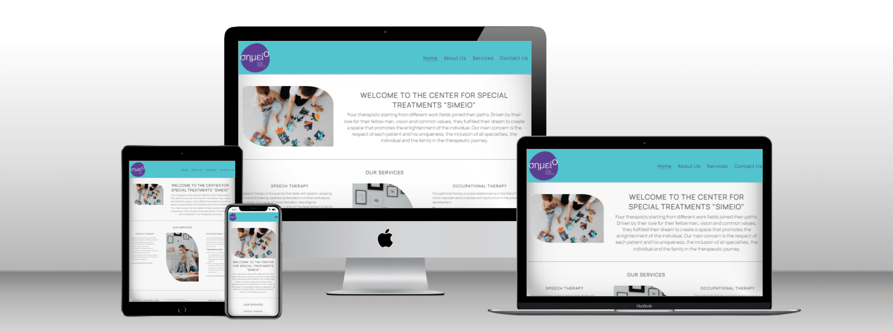

View the deployed site [Simeio Therapy](https://vasileios20.github.io/simeio-therapy/index.html)

 

## Contents

* [Design](#design)
  * [Colour Scheme](#colours-scheme)
  * [Typography](#typography)
* [User Experience (UX)](#user-experience-ux)  
* [Features](#features)
  * [Home Page](#home-page)
    * [Services section](#services-section)
  * [About Us Page](#about-us-page)
    * [Our Team section](#our-team-section)
  * [CV Pages](#cv-pages)
  * [Services Pages](#services-pages)
  * [Contact Us Page](#contact-us-page)
  * [Thank you Page](#thank-you-page)
* [Technologies Used](#techonologies-used)
  * [Languages Used](#languages-used)
  * [Frameworks, Libraries & Programs Used](#frameworks-libraries--programs-used)
* [Deployment and Local Development](#deployment-and-local-development)
  * [Deployment](#deployment)
  * [Local Development](#local-development)
    * [How to fork](#how-to-fork)
    * [How to clone](#how-to-clone)
* [Testing](#testing)
* [Credits](#credits)
  

# Design

  * ## Colour Scheme
  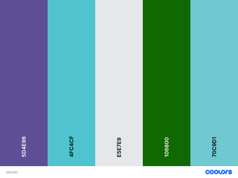

  The #5D4E96 and the #4FC4CF were chosen by the owners of the Special Treatments Center.

  The rest of the colours were chosen to match the two above.

  Opacity has been used for : 
  | Colour | Opacity |
  | ---| ---|
  | #4FC4CF | rgba(79, 196, 207, 0.4) |
  | #E5E7E9 | rgba(229, 231, 233, 0.7) |
  | #70C9D1 | rgba(112, 201, 209, 0.1) | 
  | #70C9D1 | rgba(112, 201, 209, 0.3) |

  Other colours have been used :

  #616161 , #f74242 , #fafafa , #3f3f3f

  * ## Typography
  The Manrope font was chosen by the owners of the Special Treatment Center.

  The font imported from [Google fonts](https://fonts.google.com/specimen/Manrope?query=man).

  Font weights used : 400, 500, 600

# User Experience (UX) 

|| Goal | |
|--|--|--| 
|Client|A simple and easy to navigate website| 
||To encourage people learn about learning disabilities| 
||To help people identify signs of learning diasabilities| 
|First Time User|I want to learn what services the special treatments center offer| 
||I want to learn about the therapists experience | 
||I want to know where the special treatments center is located | 
||I want to navigate easily to the website| 
||I want to connect on their social media| 
||I want to see if they offer any internship *| 
|Returning User | I want to be able to contact the special treatments center for any queries I have | 
||I want to sign up for their newsletter *|
|Frequent User | I want to find out if there is a new service *|
||I want to find out about new members in the team *|
*To be implemented in the future

# Features

The site consists of a home page, an about us page in which there 4 cards with links to cv pages, 4 services pages, a contact page and a thank you page that is shown when the contact form has been submited.

All pages on the site are responsive and have :
 * A favicon and a title of the active page on the browser tab.

 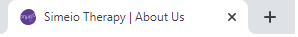

 * A logo image on top left corner which acts and as home button.

 * A nav bar with 4 links : Home, About us, Services, Contact us.

 * A dropdown menu on hover to the services button with white background and coloured on hover with links to each service's page.

 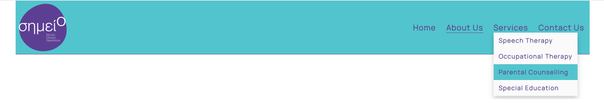 
 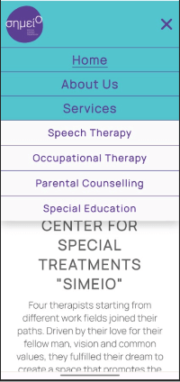

 * A footer section with social links that open in a new tab, contact information, an iframe with a pin on the address and a contact us with a link to the contact us page.
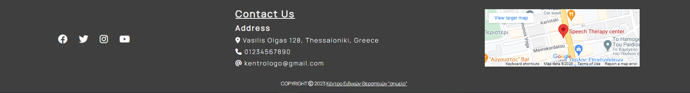

## Home Page

The Home Page consists of an image on the left hand and a paragraph with a short story of the therapists on the right hand, a [services section](#services-section) with an image in the between two services, which are in two rows, the first paragraph of each service with link to the service's page.

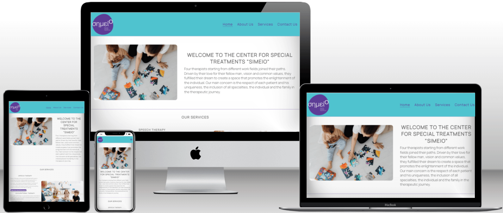

### Services section

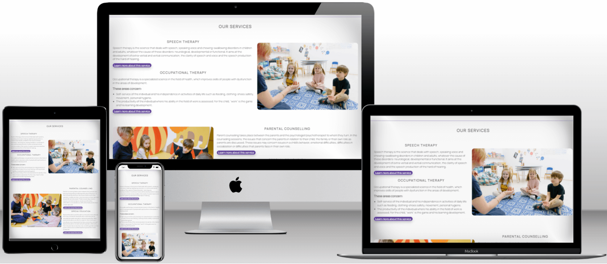

## About Us Page

The About Us Page consists of an image on the left hand and a paragraph with a short story of the therapists on the right hand and a [our team section](#our-team-section) with 4 cards of the therapists with links to CV Pages. These links contained on the "View profile" button in which there is shadow to create 3D effect.

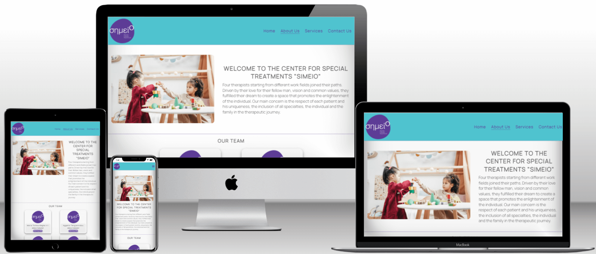

### Our Team section

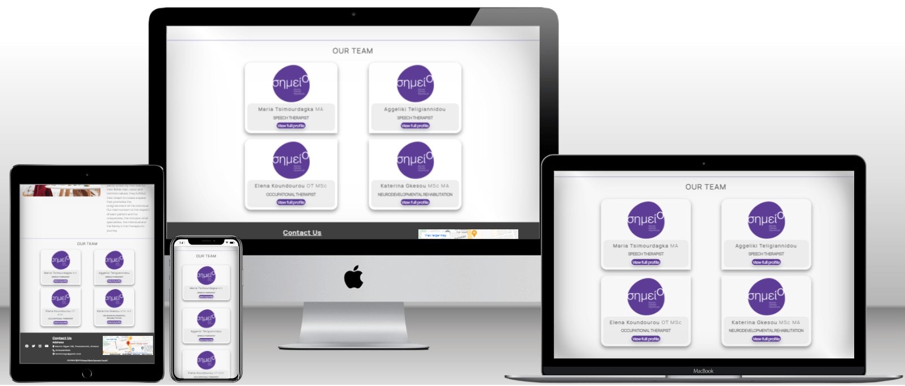

## CV Pages

The CV Pages contain the bio of each therapist.

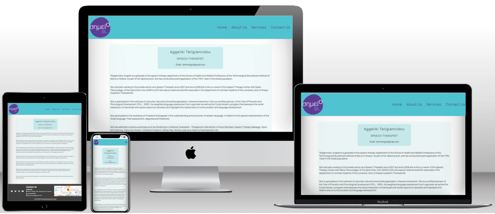

## Services Pages
The Services Pages consists of an image to the right hand and info of the service.

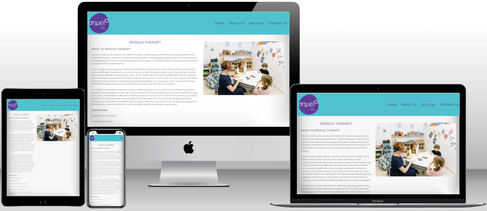

## Contact Us Page
The Contact Us Page consists of a contact form with the fields : user's first and last name, email address, contact number, a subject, a text area to comment and a submit button in which there is shadow to create 3D effect. All fields are required. When the form is submitted it links to the [Thank you Page](#thank-you-page).

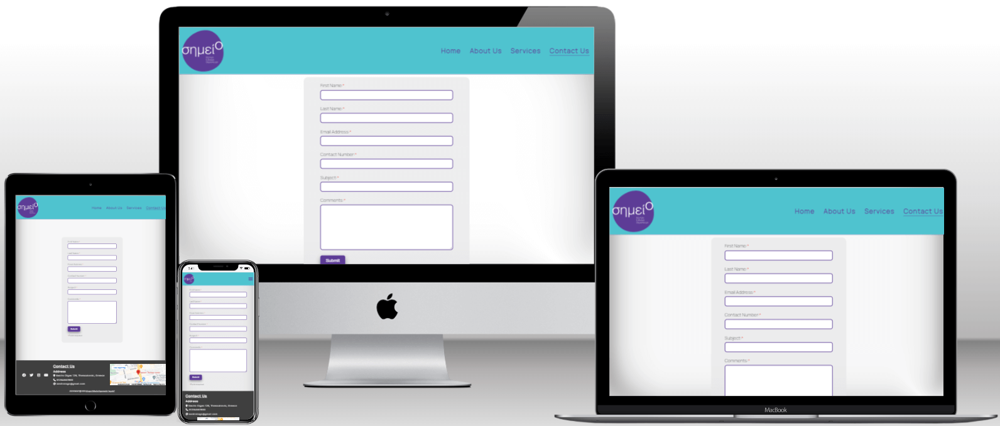

## Thank you Page
The Thank you Page consists of a message that confirms form's submition and an image of the logo with link to the home page.

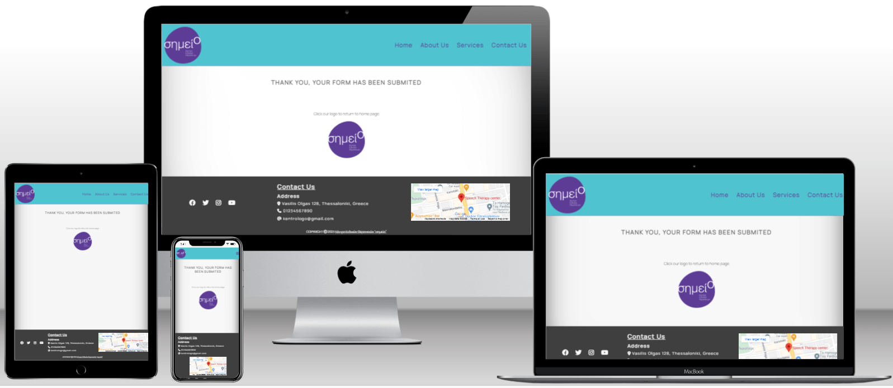

## Error Page
The error page displays an error message and there is a logo image with link to the home page.
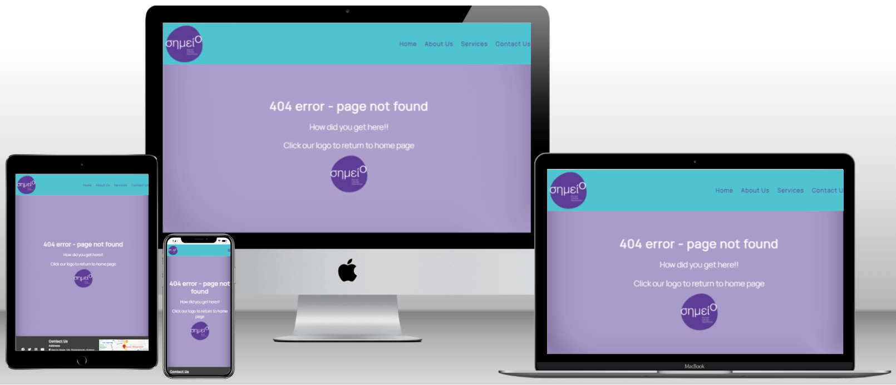

## Future Features

Implement Career Page to inform about and offer graduates internship.

Implement Newsletter.

Add new team members.

Add new services.

# Techonologies Used
## Languages Used
HTML, CSS

## Frameworks, Libraries & Programs Used
* [GitHub](https://github.com/) - To save and store files for the website.
* [GitPod](https://gitpod.io/) - IDE used to create the site.
* [Techsini](https://techsini.com/multi-mockup/index.php) - To show the web image in various devices.
* [Google Fonts](https://fonts.google.com/) - To import the fonts used on the website
* [Google Developer Tools](https://developer.chrome.com/docs/) - To test features, resposiveness and stylilng.
* [TinyPNG](https://tinypng.com/) - To reduce size of the images.
* [Favicon](https://favicon.io/) - To create favicon.
* [Shields IO](https://shields.io/) - To add badges to README.
* [Coolors](https://coolors.co/) - To create palette image to README.
* [Font Awesome](https://fontawesome.com/icons) - To create icons

# Deployment and Local Development
## Deployment
The site is deployed using GitHub Pages. Deployed site [Simeio Therapy](https://vasileios20.github.io/simeio-therapy/index.html)

To deploy the site to GitHub Pages :
1. Log in (sign up) to GitHub.
2. Go to the repositoty for this project [Simeio Therapy](https://github.com/Vasileios20/simeio-therapy).
3. Go to settings.
4. Select Pages from the left hand menu.
5. From the dropdown menu at source select the main branch and press save.
6. The site has been deployed. Check at the top of the page, it might take a couple of minutes.

## Local Development
### How to fork
To fork the repository :
1. Log in (sign up) to GitHub.
2. Go to the repository for this project [Simeio Therapy](https://github.com/Vasileios20/simeio-therapy).
3. Click the fork button in the top right corner.

### How to clone
To clone the repository :
1. Log in (sign up) to GitHub.
2. Go to the repository for this project [Simeio Therapy](https://github.com/Vasileios20/simeio-therapy).
3. Click on the code button, select one of the HTTPS, SSH or GitHub CLI and copy the link shown.
4. Open the terminal in your code editor and change the current working directory to the location you want to use for the cloned directory.
5. Type 'git clone' into the terminal and then paste the link you copied in step 3. Press enter.

# Testing
